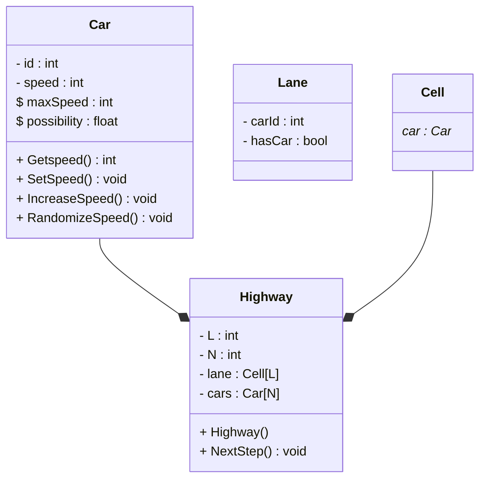
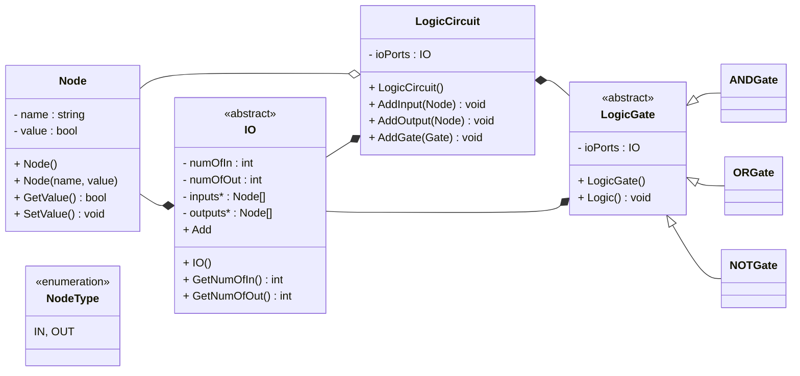

## Autópálya forgalom
Készítsen objektummodellt az autópálya forgalmának modellezésére! Egy L cellára osztott autópályán N autó van. Egy cellában csak egy autó tartózkodhat egyszerre, így L-N cella üres. Minden autónak van egy egész értékű sebessége. A szimulációt ciklusonként végezzük. Minden ciklusban minden autóra elvégezzük a következő műveleteket:

1. Ha egy autó sebessége még nem érte el a maximumot (5), akkor a sebességét eggyel megnöveljük.
2. Ha egy autó előtt levő üres cellák száma (az előtte levő autóig) kisebb, mint a sebessége, akkor az autó sebességet lecsökkentjük az előtte levő üres cellák számának megfelelő értékre.
3. Egy adott p(=0.15) valószínűséggel csökkentjük a mozgó autók sebességet eggyel. (Vezetők figyelmetlensége).
4. Minden autót előremozgatunk annyi cellával, amennyi a sebessége. 

Egyszerű karakteres kimenetet feltételezve "rajzolja ki" az autópálya állapotát egy-egy szimulációs ciklus után.
Demonstrálja a működést külön modulként fordított tesztprogrammal! A megoldáshoz ne használjon STL tárolót!

## Szerverfarm
Tervezzen objektummodellt számítógépek üzemeltetését segítő felügyeleti rendszer működésének modellezésére!
A modellben legyenek érzékelők (diszk kapacitás, memória kapacitás, processzor terheltség, szerverszoba hőmérséklet, tűzjelző, stb.), logikai kapuk (és, vagy, nem) kapcsolók, és vészcsengő! Tetszőlegesen bonyolult modell legyen felépíthető a komponensek és a logikai kapuk egyszerű összekapcsolásával!
Demonstrálja a működést külön modulként fordított tesztprogrammal! A megoldáshoz ne használjon STL tárolót!

