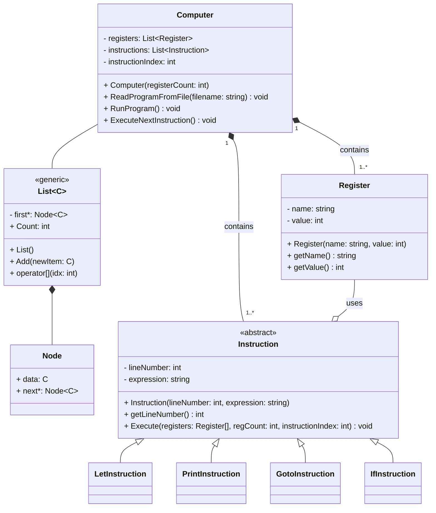

# Prog 2 Nagyházi - BASIC interpeter

```mermaid
classDiagram
    direction TB
    class List~C~{
        <<generic>>
        - first*: Node~C~
        + Count: int
        + List()
        + Add(newItem: C)
        + operator[](idx: int)
    }
    class Node { 
        + data: C
        + next*: Node~C~ 
    }
    
    class Computer {
        - registers: List~Register~
        - instructions: List~Instruction~
        - instructionIndex: int
        + Computer(registerCount: int)
        + ReadProgramFromFile(filename: string) void
        + RunProgram() void
        + ExecuteNextInstruction() void
        
    }    
    class Instruction {
        <<abstract>>
        - lineNumber: int
        - expression: string
        + Instruction(lineNumber: int, expression: string)
        + getLineNumber() int
        + Execute(registers: Register[], regCount: int, instructionIndex: int) void
    }
    class LetInstruction
    class PrintInstruction
    class GotoInstruction
%%    class AddInstruction
%%    class SubtractInstruction 
    class IfInstruction
    
    class Register{
        - name: string
        - value: int
        + Register(name: string, value: int)
        + getName() string
        + getValue() int
    }
    
    List *-- Node
    
    Computer "1" *-- "1..*" Instruction : contains
    Computer "1" *-- "1..*" Register : contains
    Computer -- List 
    
%%    Instruction o-- Register
    Register --o Instruction : uses
    
    Instruction <|-- LetInstruction
    Instruction <|-- PrintInstruction
    Instruction <|-- GotoInstruction
%%    Instruction <|-- AddInstruction
%%    Instruction <|-- SubtractInstruction
    Instruction <|-- IfInstruction
```