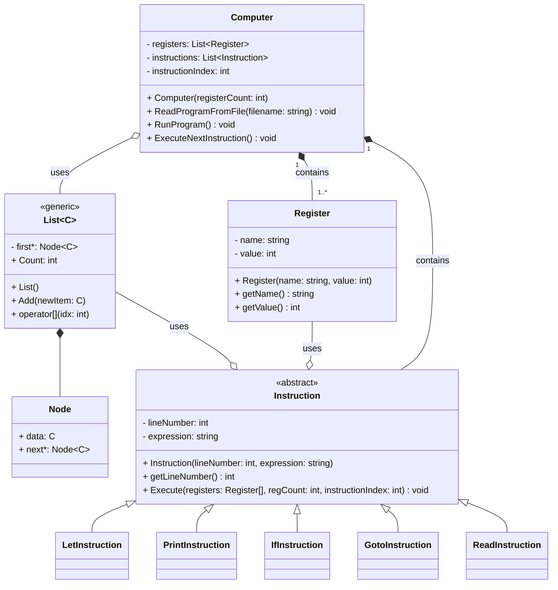

# Prog 2 Nagyházi - BASIC interpeter

## Parancsok

- `let <regiszter> = <érték>`: Regiszternek értékadás. Az érték tartalmazhat matematikai alapműveleteket. (+,-,*,/)
- `print <regiszter>`: Kiírja a regiszter értékét a szabványos kimenetre.
- `if <feltétel>`: Feltételes elágazás. Ha a feltétel igaz, akkor végrehajtja a következő utasítást a sorban, ellenkező esetben az következő utáni utasításra ugrik a program. A feltétel tartalmazhat logikai operátorokat. (>,>=,<,<=,==,!=,&,|,!)
- `goto <sorazonosító>`: Ha megtalálható, akkor a megjlelölt sorazonosítóhoz ugrik a program.
#### Tervben:
- `read <regiszter>`: Beolvassa a szabványos bemenetről egy számot és eltárolja az éréket a regiszterben.

