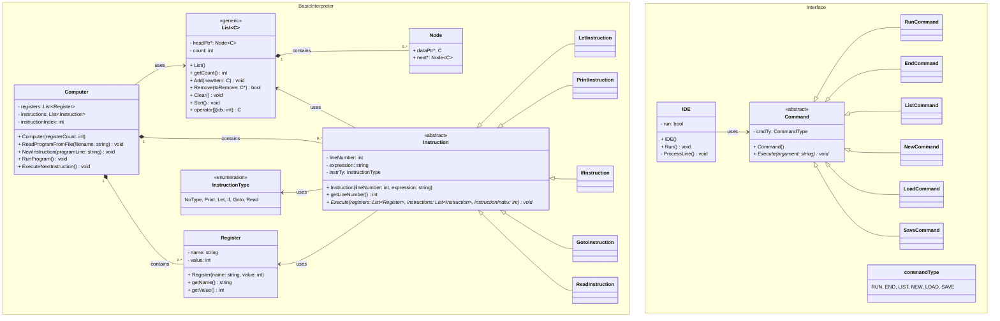

# Prog 2 Nagyházi - BASIC interpeter
## Feladatleírás
Egy egyszerű BASIC-szerű nyelven programozható kalkulátornak egyetlen regisztere (a) és egy ciklusszámlálója (i) van. A számítási eredmények mindig az a regiszterben keletkeznek. A ciklusszámláló értékétől függően pedig feltételes ugrást lehet megvalósítani. Így igen egyszerű számítások programozhatók be. Az alábbi program például kiírja az első 5 páratlan számot.
```
10 let a=1
20 let i=5
30 print a
40 let a=a+2
50 let i=i-1
60 if i>0
70 goto 30
```
Készítsen objektummodellt a kalkulátor működésének modellezésére! Definiáljon utasítás-objektumokat (`Instruction`), melyek egy tároló (`List<Instruction> instructions`) objektumban tárolhatók. A működtető program (`Computer`) feladata a tárolóból kivenni a soron következő utasítás-objektumot és végrehajtani azt, majd meghatározni a soron következő utasítás helyét.
Bővítse a modellt újabb utasításokkal (pl. input) és újabb regiszterekkel!
Demonstrálja a működést egy olyan programmal ami n!-t számol! n értékét olvasa be! A megoldáshoz ne használjon STL tárolót!  
Megj: nem BASIC interpretert kell írni!

## Program parancsok

- `let <regiszter> = <érték>`: Regiszternek értékadás. Az érték tartalmazhat matematikai alapműveleteket. (+,-,*,/)
- `print <regiszter>`: Kiírja a regiszter értékét a szabványos kimenetre.
- `if <feltétel>`: Feltételes elágazás. Ha a feltétel igaz, akkor végrehajtja a következő utasítást a sorban, ellenkező esetben az következő utáni utasításra ugrik a program. A feltétel tartalmazhat logikai operátorokat. (>,>=,<,<=,==,!=,AND,OR,NOT)
- `goto <sorazonosító>`: Ha megtalálható, akkor a megjlelölt sorazonosítóhoz ugrik a program.
#### Tervben:
- `read <regiszter>`: Beolvassa a szabványos bemenetről egy számot és eltáro~~lja az éréket a regiszterben.

## BASIC interpreter - Osztálydiagram



### Hátralévő feladatok
- [ ] Let Instruction kidolgozása
- [x] Print Instruction kidolgozása
  - [x] Regsizter kiiratás
  - [x] Szöveg kiiratás
- [ ] If Instrucion kidolgozása
- [x] Goto Instruction kidolgozása
- [ ] Read Instrucition kidolgozása
- [ ] Begin...End block
- [x] ExecuteNextInstruction megírása
- [ ] Interfész kidolgozása

## Interfész parancsok
- `RUN`: Futtatja a betöltött programot.
- `END`: Lezárja az aktuális interfészt (kód szerkesztő/alkalmazás).
- `LIST`: Kiírja a betöltött programot sorszám szerint növekvő sorban.
- `NEW`: Új programot hoz létre.
- `LOAD <fájlnév>`: Beolvassa fájlból a programot a kapott fájlnévvel.
- `SAVE <fájlbnév>`: Elmenti a megírt programot a megadott fájlnévvel.
