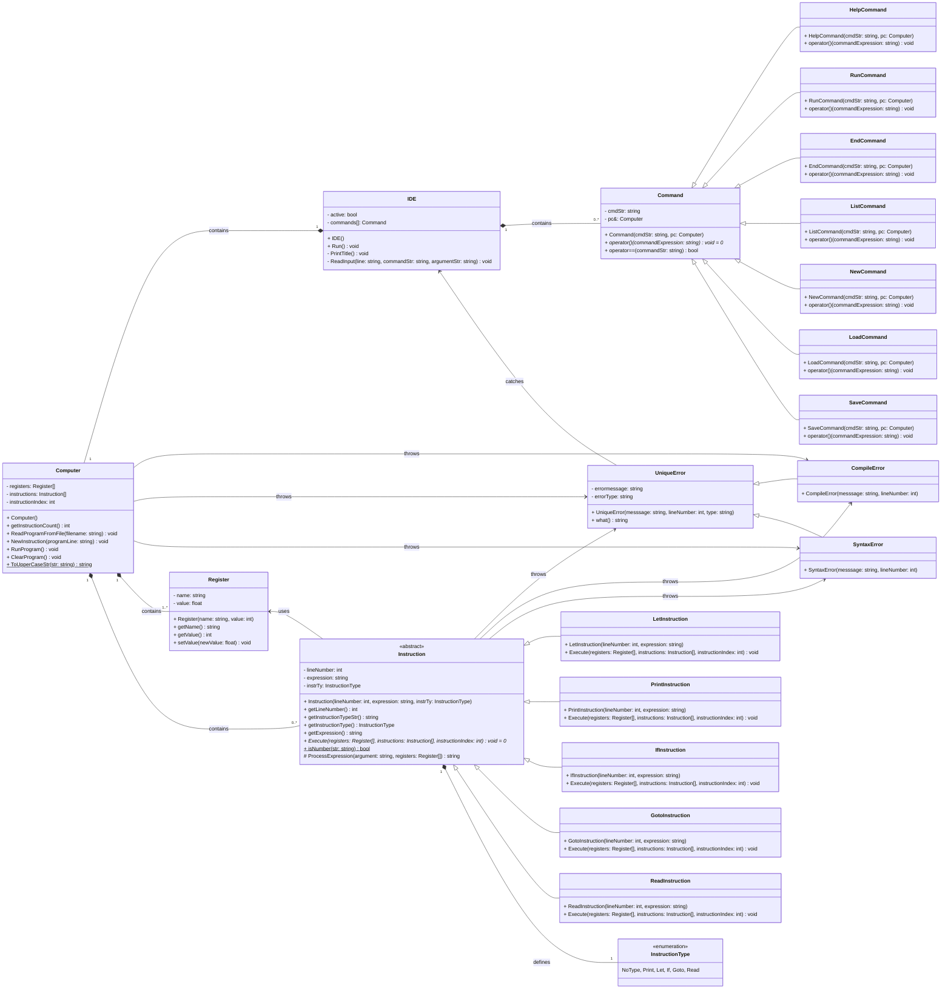

# BASIC-lite interpreter - Dokumentáció

> Írta: Szenes Márton Miklós, Neptun kód: KTZRDZ, Készült: [Dátum] Budapest

## Tartalom

## Feladatspecifikáció

A program egy **BASIC**-szerű programozási nyelv butított, egyszerűsített változatát valósítja meg, továbbiakban **BASIC-lite**-nak nevezve. Biztosít a programkód írásához egy interfészt, alap parancsokat a kód szerkesztéséhez, mentéséhez, beolvasásához és futtatásához.

Az értelmező képes regiszterekben számértékeket eltárolni és azokkal műveleteket végezni, feltételes utasításokat végrehajtani, és ugrani a programkódon belül, kiírni a standard kimenetre, és olvasni a standard bementről.

# BASIC-lite interpreter használata (felhasználó szemmel)

## Interfész és kódolás

A program indulásakor egy CLI-s felület fogadja a felhasználót. 
Itt az alábbi parancsok adhatóak ki:

- `HELP`: Kiírja az interfész parancsait, és működésüket
- `RUN`: Futtatja a betöltött programot.
- `END`: Lezárja az aktuális interfészt (kód szerkesztő/alkalmazás).
- `LIST`: Kiírja a betöltött programot sorszám szerint növekvő sorban.
- `NEW`: Új programot hoz létre.
- `LOAD <fájlnév>`: Beolvassa fájlból a programot a kapott fájlnévvel.
- `SAVE <fájlnév>`: Elmenti a betöltött programot a megadott fájlnévvel.
- `<sorszám> <utasítás> <paraméter>`: Hozzáad egy utasítást a program utasítássorozatához.
- `-<sorszám>`: Törli a sorszámként azonosított utasítást a program utasítássorozatából ha létezik ilyen.

(A program semelyik parancsa sem nagybetű/kisbetű érzékeny, kivéve ha sztring literált ad meg a felhasználó vagy elérési útvonalat.)

Egy sor begépelésekor a sor végén `Enter`-t leütve a program kiértékeli a parancsot.

- Ha interfész parancs(`HELP`/`RUN`/`END`/`LIST`/`SAVE`/`LOAD`), akkor végre hajtaja a parancs szerinti változtatásokat az interfészben. (például fájlt beolvas vagy kiír, vagy új projektet nyit, stb.)
- Ha program utasítás, akkor eltárolja azt az értelmező a memóriájában.
- Ha a program utasítás sorszáma negatív, akkor az annak a sorszámnak vett abszolút értékű utasítást törli az értelmező memóriájából, ha van ilyen.

Az interfész utasítás abban különbözik a program kódsortól, hogy a kódsor első argumentuma egy sorszám, míg az interfészbeli parancsok első argumentuma nem tartalmazhat számot.

### BASIC-lite szintaxis

Egy program kódsornak 3 argumentuma van mindig: `sorszám`, `utasítás`, `paraméter`.
Ezen paraméterek egymástól legalább egy szóközzel kell legyenek elválasztva.
A paraméteren belül tetszőleges 'whitespace' lehet, mivel az értelmező törli majd ezeket.
Ezért fontos, hogy ha két karaktersorozatot egymás mellé írunk egy szóközzel elválasztva, úgy azt az értelmező egy szóként fogja kezelni.
Ezalól kivétel, ha sztringet írunk be a `print` utasításhoz, aminél természetesen nem törlődnek a 'whitespace' karakterek.

Így például a `10 let a = 4 * ( b - c )` sort így bontja fel:

| Sorszám   | Utasítás  | Paraméter   |
|-----------|-----------|-------------|
| `10`      | `let`     | `a=4*(b-c)` |

Ahol az `a` lesz a balérték, és a `4*(b-c)` az értékadás jobbértéke, ahol `b` és `c` regiszterneveket jelölnek, és annak értékeire hivatkoznak.

#### Sorszám

Egy program kódsor sorszám egy 0-nál nagyobb pozitív egész szám mindig.
Amennyiben a sorszám 0, úgy az a sor kommentnek tekintendő, és nem kerül kiértékelésre a futtatás során.
Ha a sorszám negatív, úgy a fent említett módon törlődik az utasítás a program memóriából. Minden más esetben, ha az első argumentum nem egy egész szám, úgy a program hibát dob.

#### Utasítás és paraméterek

A második paraméter az utasítás kulcsszó. Ezután következik a harmadik paraméter, ami egészen a sor végéig tart.  
A program 5 féle utasítást tud értelmezni. Ezek a következők, és a színtaktikájuk:

- `let <regiszter> = <érték>`: Regiszternek értékadás. Az érték tartalmazhat matematikai alapműveleteket (`+`,`-`,`*`,`/`), maradékos osztást (`%`) és zárójeleket (`(`,`)`).
- `print <regiszter>/<string>`: Kiírja a regiszter vagy a kapott idézőjelek közé tett sztring értékét a szabványos kimenetre. A sztring tartalma kizárólag az angol abc nagy- és kisbetűit tartalmazhatja, illetve `\n`(sortörés), `\t`(tab), `\"`(idézőjel) speciális karaktereket.
- `if <feltétel>`: Feltételes elágazás. Ha a feltétel igaz, akkor végrehajtja a következő utasítást a sorban, ellenkező esetben az következő utáni utasításra ugrik a program. A feltétel tartalmazhat számokat, regisztereket, összehasonlító operátorokat, és/vagy/nem logikai kapukat és zárójeleket. (`>`,`>=`,`<`,`<=`,`==`,`!=`,`&&`,`||`,`!`)
- `goto <sorazonosító>`: Ha létezik a sorazonosító, akkor a megjlelölt sorazonosítóhoz ugrik a program. Ha nincs ilyen, akkor hibát dob az értelmező.
- `read <regiszter>`: Beolvas a szabványos bemenetről egy számot és eltárolja az éréket a regiszterben.

## Hibakezelés

Az interfész minden helytelenül bevitt parancsra hibát dob, és ki is írja mi a hiba oka.
Valamint a **BASIC-lite** értelmező is minden lehetséges kód elírásra kivételt dob, mely tartalmazza a hiba részletes okát, és helyét a kódban.

### Lehetséges hibaüzenetek

# BASIC-lite interpreter felépítése (programozó szemmel)

## UML osztálydiagram

## Osztály- és függvény dokumentáció

> A program angol nyelven íródott, ezért az osztályok, függvények, és változók nevei mind angolul szerepelnek, ebből kifolyólag a dokumentációjuk is angolul íródott.  

<!-- BEGIN DOC-COMMENT ../Project Jporta/IDE.h -->
<!-- END DOC-COMMENT --> 

<!-- BEGIN DOC-COMMENT ../Project Jporta/Command.h -->
<!-- END DOC-COMMENT --> 

<!-- BEGIN DOC-COMMENT ../Project Jporta/HelpCommand.h -->
<!-- END DOC-COMMENT --> 

<!-- BEGIN DOC-COMMENT ../Project Jporta/RunCommand.h -->
<!-- END DOC-COMMENT --> 

<!-- BEGIN DOC-COMMENT ../Project Jporta/EndCommand.h -->
<!-- END DOC-COMMENT --> 

<!-- BEGIN DOC-COMMENT ../Project Jporta/ListCommand.h -->
<!-- END DOC-COMMENT --> 

<!-- BEGIN DOC-COMMENT ../Project Jporta/NewCommand.h -->
<!-- END DOC-COMMENT --> 

<!-- BEGIN DOC-COMMENT ../Project Jporta/LoadCommand.h -->
<!-- END DOC-COMMENT --> 

<!-- BEGIN DOC-COMMENT ../Project Jporta/SaveCommand.h -->
<!-- END DOC-COMMENT --> 

<!-- BEGIN DOC-COMMENT ../Project Jporta/Register.h -->
<!-- END DOC-COMMENT --> 

<!-- BEGIN DOC-COMMENT ../Project Jporta/Instruction.h -->
<!-- END DOC-COMMENT --> 

<!-- BEGIN DOC-COMMENT ../Project Jporta/PrintInstruction.h -->
<!-- END DOC-COMMENT --> 

<!-- BEGIN DOC-COMMENT ../Project Jporta/LetInstruction.h -->
<!-- END DOC-COMMENT --> 

<!-- BEGIN DOC-COMMENT ../Project Jporta/GotoInstruction.h -->
<!-- END DOC-COMMENT --> 

<!-- BEGIN DOC-COMMENT ../Project Jporta/IfInstruction.h -->
<!-- END DOC-COMMENT --> 

<!-- BEGIN DOC-COMMENT ../Project Jporta/ReadInstruction.h -->
<!-- END DOC-COMMENT --> 

<!-- BEGIN DOC-COMMENT ../Project Jporta/Computer.h -->
<!-- END DOC-COMMENT --> 

<!-- BEGIN DOC-COMMENT ../Project Jporta/UniqueError.h -->
<!-- END DOC-COMMENT --> 

<!-- BEGIN DOC-COMMENT ../Project Jporta/SyntaxError.h -->
<!-- END DOC-COMMENT --> 

<!-- BEGIN DOC-COMMENT ../Project Jporta/CompileError.h -->
<!-- END DOC-COMMENT --> 