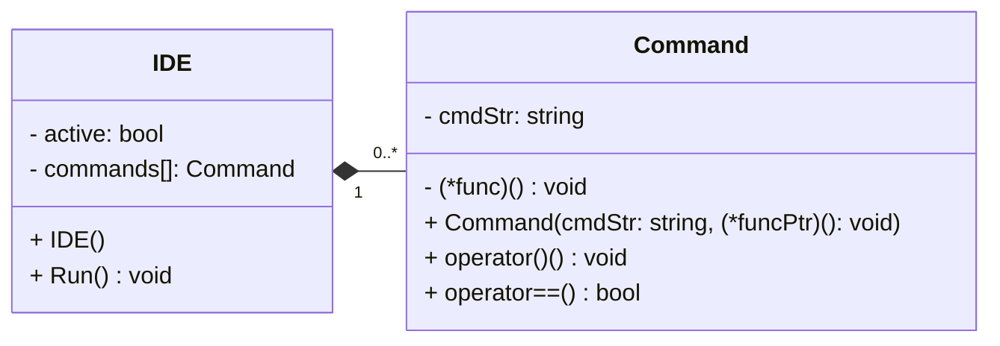
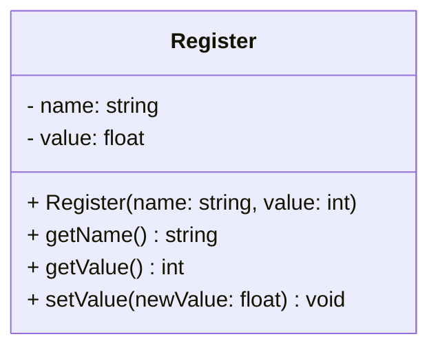
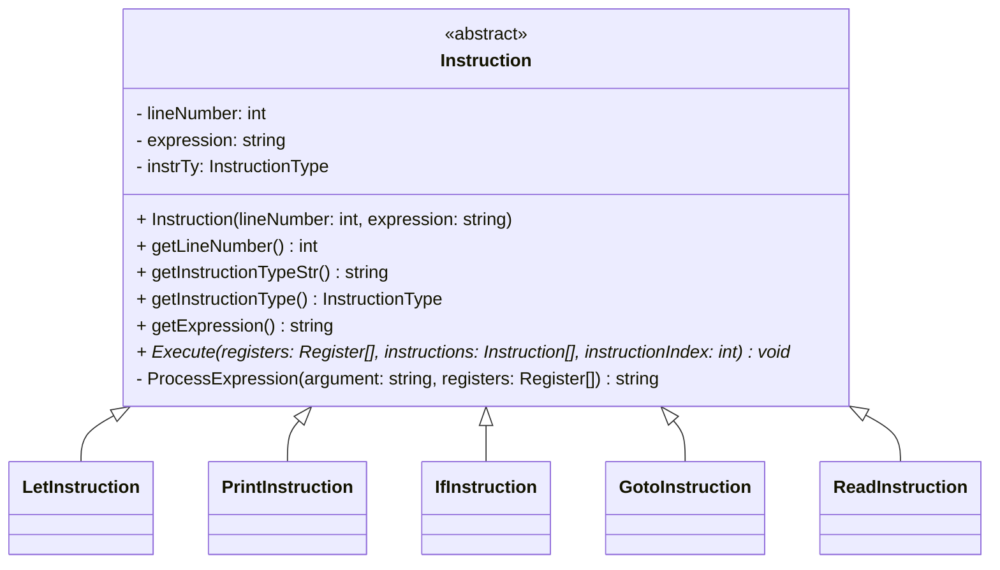

# BASIC-lite interpreter - Terv

> Írta: Szenes Márton Miklós, Neptun kód: KTZRDZ

## Tartalom
1. [Feladatspecifikáció](#feladatspecifikáció)
2. [Interfész](#interfész-ide)
   - [Interfész parancsok](#interfész-parnacsok-command)
   - [Kódolás](#kódolás)
3. [BASIC-lite szintaxis](#basic-lite-szintaxis)
4. [Regiszterek](#regiszterek-register)
5. [Program utasítás](#program-utasítás-instruction)
   - [Értelmezett utasítások](#értelmezett-utasítások)
6. [Hibakezelés](#hibakezelés)

## Feladatspecifikáció

A program egy **BASIC**-szerű programozási nyelv butított, egyszerűsített változatát valósítja meg, továbbiakban **BASIC-lite**-nak nevezve. Biztosít a programkód írásához egy interfészt, alap parancsokat a kód szereksztéséhez, mentéséhez, beolvasásához és futtatásához.

Az értelmező képes regiszterekben számértékeket eltárolni és azokkal műveleteket végezni, feltételes utasításokat végrehajtani, és ugrani a programkódon belül, kiírni a standard kiementre, és olvasni a standard bementről.

## Interfész: `IDE`

A program indulásakor egy CLI-s felület fogadja a felhasználót. 
Ezt az `IDE` osztály fogja működtetni. Az itt kiadható parancsokat `Command`-ként tartja nyilván az `IDE` egy listában.

Interfész állapot: `active`
: Az `IDE` osztályban a program futási állapotát az `active` logikai érték tárolja. Ameddig igaz, addig fut a program.

Interfész parancsok: `commands[]`
: A `commands[]` tárolja a felhasználó által végrehajtható parancsokat, melyek egy-egy `Command` class elemei, ami a parancs megnevezését(`cmdStr`), és a végrehajtásakor meghívandó függvénypointerét(`(*func)()`) tartalmazza.

### Interfész parnacsok: `Command`

- `HELP`: Kiírja az interfész parancsait, és működésüket.
- `RUN`: Futtatja a betöltött programot.
- `END`: Lezárja az aktuális interfészt (kód szerkesztő/alkalmazás).
- `LIST`: Kiírja a betöltött programot sorszám szerint növekvő sorban.
- `NEW`: Új programot hoz létre.
- `LOAD <fájlnév>`: Beolvassa fájlból a programot a kapott fájlnévvel.
- `SAVE <fájlnév>`: Elmenti a betöltött programot a megadott fájlnévvel.

### Kódolás

Az `IDE` folyamatosan bekér a felhasználótól egy sort, aminek végén `Enter`-t leütve a program kiértékeli a parancsot.

- Ha interfész parancs(`Command`), akkor végre hajtaja az adott parancsot az IDE.
- Ha program utasítás(`Instruction`), akkor eltárolja azt az értelmező(`Computer`) a program memóriájában.
- Ha a program utasítás sorszáma negatív, akkor az annak a sorszámnak vett abszolút értékű utasítást törli az értelmező(`Computer`) a program memóriájából, ha van ilyen.

Az interfész utasítás abban különbözik a program kódsortól, hogy a kódsor első argumentuma egy sorszám, míg az `IDE` utasítás első argumentuma nem tartalmazhat számot.

## BASIC-lite szintaxis

Egy program kódsornak 3 argumentuma van mindig: `sorszám`, `utasítás`, `paraméter`.
Ezen paraméterek egymástól legalább egy szóközzel kell legyenek elválasztva.
A paraméteren belül tetszőleges 'whitespace' lehet, mivel az értelmező törli majd ezeket.
Ezért fontos, hogy ha két karaktersorozatot egymás mellé írunk egy szóközzel elválasztva, úgy azt az értelmező egy szóként fogja kezelni.
Ezalól kivétel ha sztringet írunk be a `print` utasításhoz, aminél természetesen nem törlődnek a 'whitespace' karakterek.

Így például a `10 let a = 4 * ( b - c )` sort így bontja fel:

| Sorszám   | Utasítás  | Praméter    |
|-----------|-----------|-------------|
| `10`      | `let`     | `a=4*(b-c)` |

Ahol az `a` lesz a balérték, és a `4*(b-c)` az értékadás jobbértéke, ahol `b` és `c` regiszterneveket jelölnek, és annak értékeire hivatkoznak.

## Regiszterek: `Register`

Az értelmező dinamikusan létrehoz regisztereket (más néven változókat), ha az értékadás bal oldalán új regiszter név szerepel. Ezeket a program `Register` osztályban tárolja.

Regiszter neve: `name`
: Az értékadás bal oldalán szereplő kifejezés lesz regiszter neve, ahogy később hibatkozni lehet rá.

Értéke: `value`
: A regiszter aktuális értékét tárolja. Alap értéke 0.

## Program utasítás: `Instruction`

A program az egyes kódsorokat az `Instruction` absztrakt osztályból származtatott alosztályokban tárolja.

Sorszám: `lineNumber`
: Egy program kódsor sorszám egy 0-nál nagyobb pozitív egész szám mindig.
Amennyiben a sorszám 0, úgy az a sor kommentnek tekintendő, és nem kerül kiértékelésre a futtatás során.
Ha a sorszám negatív, úgy a fent említett módon törlődik az utasítás a program memóriából. Minden más esetben, ha az első argumentum nem egy egész szám, akkor az értelmező hibát dob.

Utasítás típus: `instrTy`
: A második paraméter az utasítás kulcsszó. 
Ezt egy enumerátorként tárolja el az osztály, hogy a kiirításnál stringgé alakítható legyen az utasítás neve. 

Paraméter: `expression`
: Ezután következik a harmadik paraméter, ami egészen a sor végéig tart.

Értelmezés: `Execute(...)`
: Az egyes utasítások egyedi értelmezését az `Execute(...)` tisztán virtuális függvény kezeli, amely abszrtaktá teszi az `Instruction` osztályt.  

Kiértékelés: `ProcessExpression(...)`
: A harmadik paraméterként kapott kifejezések (pl: `a = 4*(b-c)`) kiértékelésért a `ProcessExpression(...)` függvény felel, ami a kapott bemeneti stringet kiértékeli, és egy stringben egy számértéket ad vissza. Ez végzi el a műveleteket és az értékadást, illetve ha színtaktikai hibát talál, akkor kivételt dob a hiba leírásával.

#### Műveleti sorrend és kiértékelése

| Matematikai Prioritás |        Operátor        | Magyarázat                | Kiertékelési sorrend |
|:-------------------------:|:----------------------:|---------------------------|:------------------------:|
|            1.             |        `(`,`)`         | Zárójelezés               |            2.            |
|            2.             |        `!`, `-`        | Egytagú operátorok        |            9.            |
|            3.             |        `*`, `/`        | Szorzás, osztás           |            8.            |
|            4.             |        `+`, `-`        | Összeadás, kivonás        |            7.            |
|            5.             |  `<`, `<=`, `>`, `>=`  | Összehasonlítók           |            6.            |
|            6.             |       `==`, `!=`       | Ekvivalencia operátorok   |            5.            |
|            7.             |          `&&`          | Logikai ÉS                |            4.            |
|            8.             |         `\|\|`         | Logikai VAGY              |            3.            |
|            9.             |          `=`           | Értékadás (jobbról balra) |            1.            |

### Értelmezett utasítások
A program 5 féle utasítást tud értelmezni. Ezek a következők, és a színtaktikájuk:

Értékadás: `LetInstruction`
: `let <regiszter> = <érték>`: Regiszternek értékadás. Az érték tartalmazhat matematikai alapműveleteket és zárójeleket. (`+`,`-`,`*`,`/`)

Kiiratás: `PrintInstruction`
: `print <regiszter>/<string>`: Kiírja a regiszter vagy a kapott idézőjelek közé tett sztring értékét a szabványos kimenetre. A sztring tartalma kizárólag az angol abc nagy- és kisbetűit tartalmazhatja, illetve `\n`(sortörés), `\t`(tab), `\"`(idézőjel) speciális karaktereket.

Feltételes utasítás: `IfInstruciton`
: `if <feltétel>`: Feltételes elágazás. Ha a feltétel igaz, akkor végrehajtja a következő utasítást a sorban, ellenkező esetben az következő utáni utasításra ugrik a program. A feltétel tartalmazhat számokat, regisztereket, összehasonlító operátorokat, és/vagy/nem logikai kapukat és zárójeleket. (`>`,`>=`,`<`,`<=`,`==`,`!=`,`&&`,`||`,`!`)

Ugrás: `GotoInstruction`
: `goto <sorazonosító>`: Ha létezik a sorazonosító, akkor a megjlelölt sorazonosítóhoz ugrik a program. Ha nincs ilyen, akkor hibát dob az értelmező.

Beolvasás: `ReadInstrucion`
: `read <regiszter>`: Beolvas a szabványos bemenetről egy számot és eltárolja az éréket a regiszterben.

## Hibakezelés

Az `IDE` minden helytelenül bevitt parancsra hibát dob, és ki is írja mi a hiba oka.
Valamint a **BASIC-lite** értelmező is minden lehetséges kód elírásra kivételt dob, mely tartalmazza a hiba részletes okát, és helyét a kódban.

