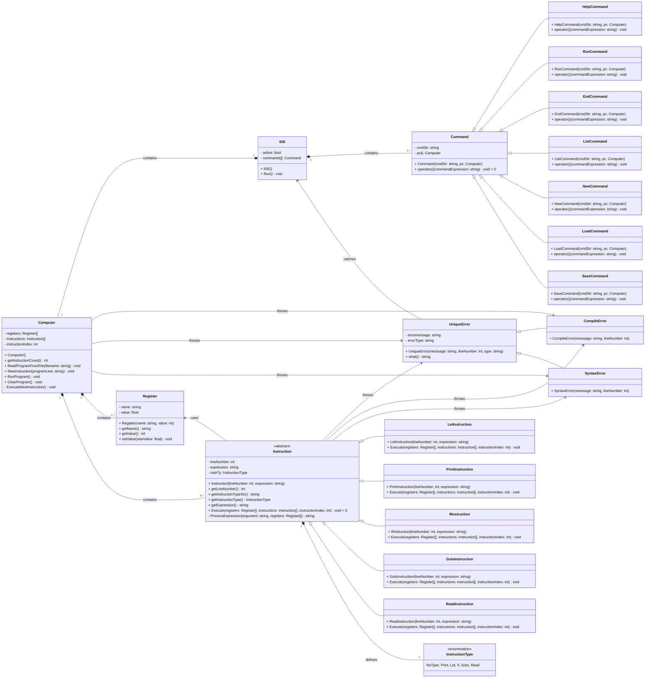

# BASIC-lite interpreter - Skeleton

> Írta: Szenes Márton Miklós, Neptun kód: KTZRDZ, Készült: 2024.04.29. Budapest

## Tartalom

- [BASIC-lite interpreter - Skeleton](#basic-lite-interpreter---skeleton)
  - [Tartalom](#tartalom)
  - [Osztályok interfészei](#osztályok-interfészei)
    - [Interfész: `IDE`](#interfész-ide)
    - [Interfész parancsok: `Command`](#interfész-parancsok-command)
      - [Interfész parancstípusok: `HelpCommand`, `RunCommand`, `EndCommand`, `ListCommand`, `NewCommand`, `LoadCommand`, `SaveCommand`](#interfész-parancstípusok-helpcommand-runcommand-endcommand-listcommand-newcommand-loadcommand-savecommand)
    - [Regiszterek: `Register`](#regiszterek-register)
    - [Program utasítás: `Instruction`](#program-utasítás-instruction)
      - [Utasítás altípusok: `PrintInstruction`, `LetInstruction`, `GotoInstruction`, `IfInstruction`, `ReadInstruction`](#utasítás-altípusok-printinstruction-letinstruction-gotoinstruction-ifinstruction-readinstruction)
    - [Program értelmező: `Computer`](#program-értelmező-computer)
    - [Kivétel: `UniqueError`](#kivétel-uniqueerror)
      - [Kivétel altípusok: `SyntaxError`, `CompileError`](#kivétel-altípusok-syntaxerror-compileerror)
  - [UML osztálydiagram](#uml-osztálydiagram)

## Osztályok interfészei

### Interfész: `IDE`

Az `IDE` egy CLI-s felületet biztosít a felhasználó és a program kommunikációjára.

```cpp
class IDE {
public:
    /** Constructs an IDE object, initializes the IDE with default commands. */
    IDE();
    /** This function runs the IDE on the terminal, allowing users to interact with it. */
    void Run();
    /** Destroys the IDE object, cleans up resources allocated by the IDE. */
    ~IDE();
};
```

### Interfész parancsok: `Command`

Az `IDE`-vel való kommunikáció során a felhasználó különböző parancsokat adhat ki a bemeneten, amik végrehajtásáért a 
`Command`, és a leszármazott osztályai felelősek. 

```cpp
class Command {
public:
    /** Creates a command that the user can use from the IDE */
    Command(Computer& pc, const char* cmdStr = "");
    /** Calls the Function dedicated to this command */
    virtual void operator()(const string& filename, bool& active) = 0;
    /** Checks if the given string is equal to the command */
    bool operator==(const string& commandStr);
    /** Destroys the command object. */
    virtual ~Command() = default;
};
```

#### Interfész parancstípusok: `HelpCommand`, `RunCommand`, `EndCommand`, `ListCommand`, `NewCommand`, `LoadCommand`, `SaveCommand`

Az alábbi `HelpCommand` osztálydeklarációhoz hasonlóan van megvalósítva a többi származtatott parancs is.

```cpp
class HelpCommand : public Command{
public:
    /** Constructs a HelpCommand object. */
    HelpCommand(Computer& pc);
    /** Executes the Help command. */
    void operator()(const string& filename, bool& active) override;
};


```

### Regiszterek: `Register`

A regiszterek nevét és állapotát tároló osztály.

```cpp
class Register {
public:
    /** Creates a Register object that stores a register's name and float value */
    explicit Register(const string& name = "", float defValue = 0);
    /** Get the name of the register */
    const string& getName() const { return name; }
    /** Get the value of the register */
    float getValue() const { return value; }
    /** Set the value of the register */
    void SetValue(float newValue) { value = newValue; }
};
```

### Program utasítás: `Instruction`

Az utasításokat leíró absztrakt osztály.

```cpp
class Instruction {
public:
    /** Initialize the instruction with the given base values. */
    Instruction(int lineNumber_, const string& expression_, InstructionType instructionType = NoType);
    /** Get the line number of the instruction */
    int getLineNumber() const;
    /** Get the string representation of the instruction type. */
    string getInstructionTypeStr() const;
    /** Get the type of the instruction. */
    InstructionType getInstructionType() const;
    /** Get the expression argument of the instruction. */
    string getExpression() const;
    /** This function must be implemented by derived classes to execute the specific */
    virtual void Execute(vector<Register>& registers, vector<Instruction*>& instructions, int& instructionIndex) = 0;
    /** Overloaded stream insertion operator for printing Instruction objects. */
    friend std::ostream& operator<<(std::ostream& os, const Instruction& inst);
    /** Destroys the Instruction object. */
    virtual ~Instruction() = default;
};
```

#### Utasítás altípusok: `PrintInstruction`, `LetInstruction`, `GotoInstruction`, `IfInstruction`, `ReadInstruction`

Az alábbi `PrintInstruction` osztálydeklarációhoz hasonlóan van megvalósítva a többi származtatott utasítás is.

```cpp
class PrintInstruction : public Instruction {
public:
    /** This constructor initializes a new instance of the PrintInstruction class, which represents an instruction
     * for printing output to the console. It inherits from the Instruction class. */
    PrintInstruction(int lineNumber, const string& expression);
    /** This function is a virtual method intended to execute a specific instruction within a sequence of instructions.
     * It operates on a set of registers and a list of instruction objects, moving through the instructions based on
     * the provided instruction index. */
    void Execute(vector<Register>& registers, vector<Instruction*>& instructions, int& instructionIndex) override;
};
```

### Program értelmező: `Computer`

A programot értelmező osztály.

```cpp
class Computer {
public:
    /** Creates a computer object that can run a BASIC-lite program.*/
    explicit Computer();
    /** Gives the number of instructions in the program */
    size_t getInstructionCount() const;
    /** Reads the program from the given file into the 'instructions' list. */
    void ReadProgramFromFile(const string& filename);
    /** Evaluates the read string line. Adds or removes instruction based on the line number. */
    void NewInstruction(const string& programLine);
    /** Runs the program: Executes the instructions based on the instructionIndex value which is modified according to the previous instruction. */
    void RunProgram();
    /** Clears the list of instructions from the program memory and resets the instruction count to 0. */
    void ClearProgram();
    /** Lists the instructions stored in the memory of the computer. */
    friend std::ostream& operator<<(std::ostream& os, const Computer& pc);
    /** Destroys the Computer object, cleans up resources allocated by the Computer. */
    ~Computer();
```
### Kivétel: `UniqueError`

A programban talált általános hibákat `UniqueError`-ként dobja el az értelmező.

```cpp
class UniqueError : public std::exception {
public:
    /** Constructs a UniqueError object with the given error message, optional line number, and error type. */
    explicit UniqueError(const std::string& message, int lineNumber = -1, const std::string& type = "Error");
    /** This function overrides the std::exception::what() method to provide a C-style character string describing the error condition. */
    char const* what() const throw() override;
};
```
#### Kivétel altípusok: `SyntaxError`, `CompileError`

A program értelmezése során fellépő színtaktikai hiábákat `SyntaxError`-ként, az alap fordítási hibákat pedig `CompileError`-ként dobja el az értelmező.

```cpp
class SyntaxError : public UniqueError {
public:
    /**Constructs a SyntaxError object with the given error message and optional line number. */
    explicit SyntaxError(const std::string& message, int lineNumber = -1);
};
```

```cpp
class CompileError : public UniqueError {
public:
    /** Constructs a CompileError object with the given error message and optional line number. */
    explicit CompileError(const std::string& message, int lineNumber = -1);
};
```

## UML osztálydiagram



> Írta: Szenes Márton Miklós, Neptun kód: KTZRDZ, Készült: 2024.04.29. Budapest