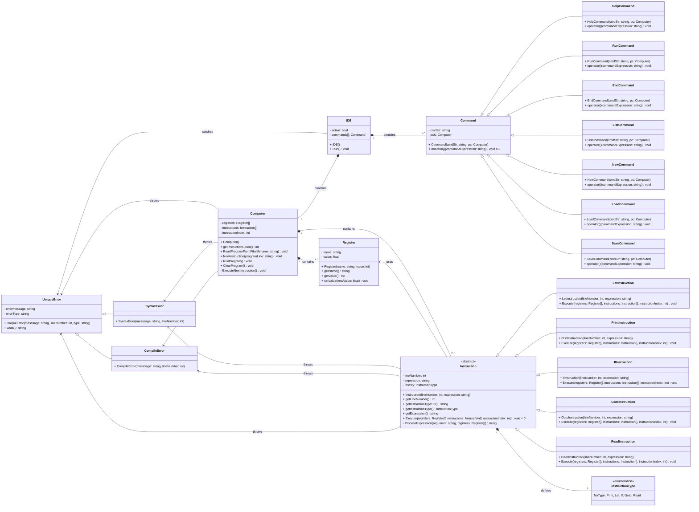

# BASIC-lite interpreter - Skeleton

> Írta: Szenes Márton Miklós, Neptun kód: KTZRDZ, Készült: 2024. Budapest

## Tartalom

- 

## Osztályok interfészei

### IDE

### Command

### Register

### Instruction

### Computer

### Kivételek

## UML osztálydiagram

> Írta: Szenes Márton Miklós, Neptun kód: KTZRDZ, Készült: 2024. Budapest