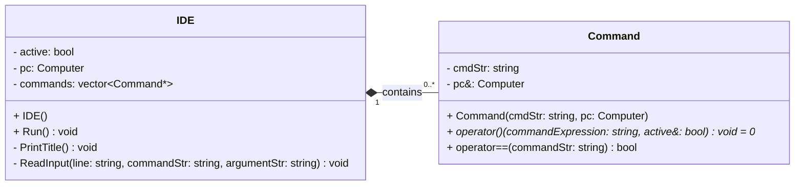
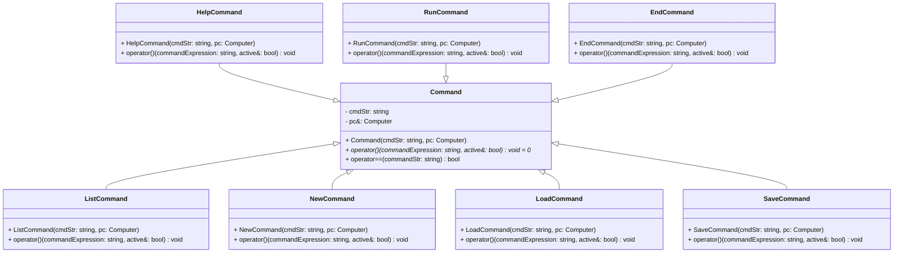
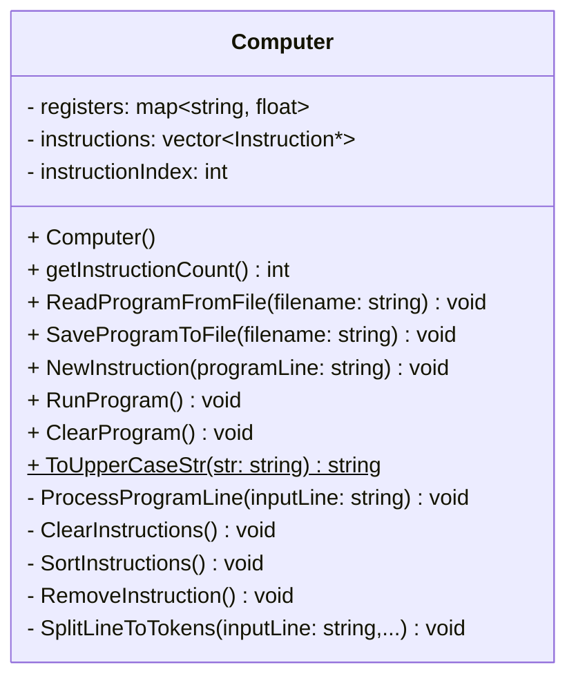
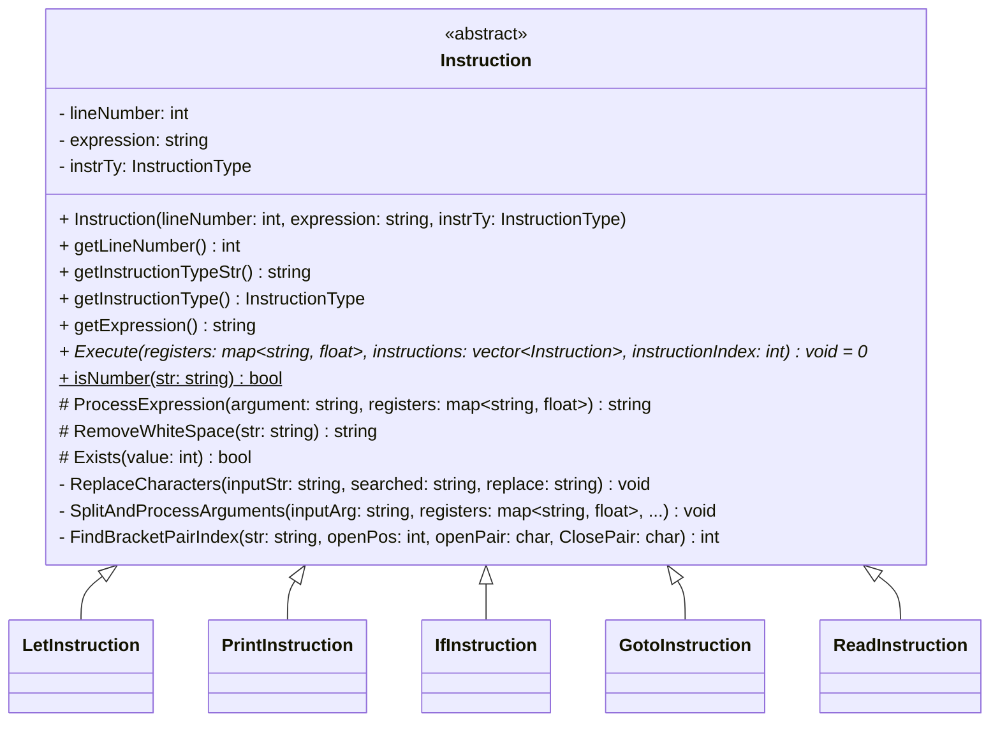
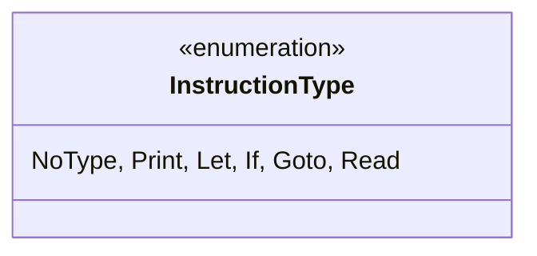
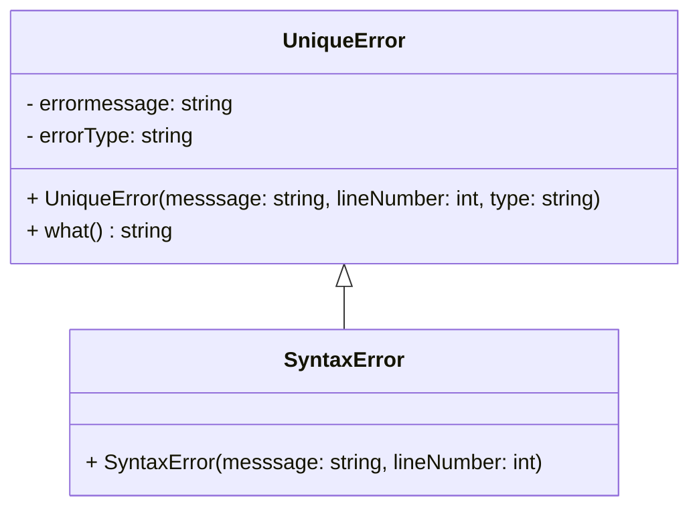
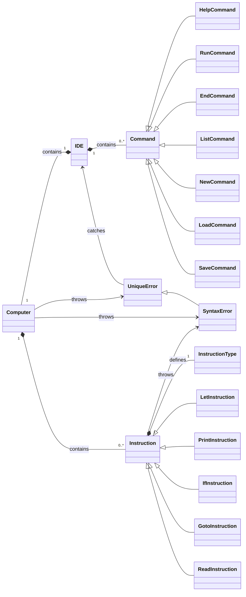
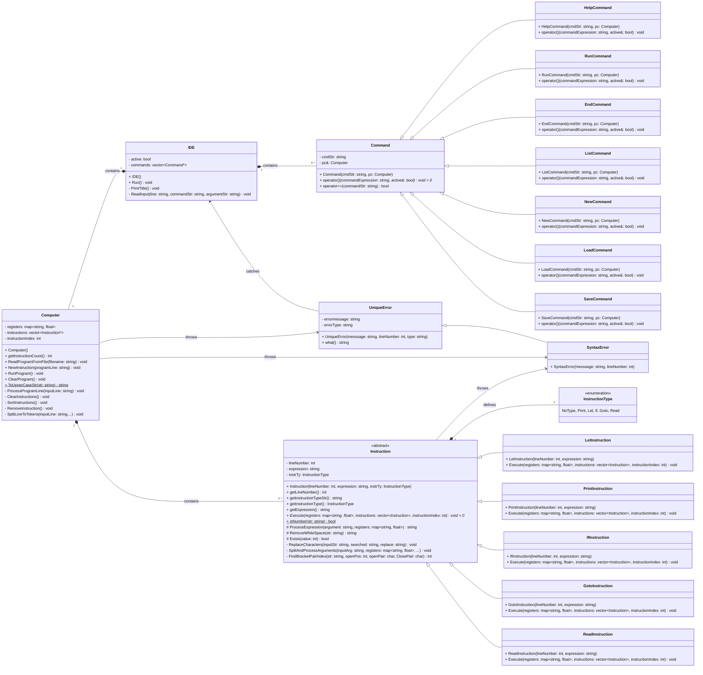

# BASIC-lite interpreter - Dokumentáció

> Írta: Szenes Márton Miklós, Neptun kód: KTZRDZ, Készült: [Dátum] Budapest

[//]: # (<div class="page"></div>)

## Tartalom

- [BASIC-lite interpreter - Dokumentáció](#basic-lite-interpreter---dokumentáció)
  - [Tartalom](#tartalom)
  - [Feladatspecifikáció](#feladatspecifikáció)
- [BASIC-lite interpreter használata - Felhasználói szemmel](#basic-lite-interpreter-használata---felhasználói-szemmel)
  - [Interfész és kódolás](#interfész-és-kódolás)
    - [Példaprogram](#példaprogram)
    - [BASIC-lite szintaxis](#basic-lite-szintaxis)
    - [Sorszám](#sorszám)
    - [Utasítás és paraméterek](#utasítás-és-paraméterek)
  - [Hibakezelés](#hibakezelés)
- [BASIC-lite interpreter felépítése - Programozói szemmel](#basic-lite-interpreter-felépítése---programozói-szemmel)
  - [Program működés](#program-működés)
  - [Felhasználóval való kommunikáció - Az interfész: IDE](#felhasználóval-való-kommunikáció---az-interfész-ide)
    - [IDE és Command kapcsolata - osztálydiagram](#ide-és-command-kapcsolata---osztálydiagram)
    - [Használata](#használata)
  - [Interfész parancsok: Command](#interfész-parancsok-command)
    - [Command és leszármazottjainak kapcsolata - osztálydiagram](#command-és-leszármazottainak-kapcsolata---osztálydiagram)
    - [Specifikus parancsok: Command leszármazottjai](#specifikus-parancsok-command-leszármazottai)
      - [Segítség: HelpCommand](#segítség-helpcommand)
      - [Program futtatása: RunCommand](#program-futtatása-runcommand)
      - [Alkalmazás bezárása: EndCommand](#alkalmazás-bezárása-endcommand)
      - [Program kilistázása: ListCommand](#program-kilistázása-listcommand)
      - [Új program létrehozása: NewCommand](#új-program-létrehozása-newcommand)
      - [Program beolvasása fájlból: LoadCommand](#program-beolvasása-fájlból-loadcommand)
      - [Program mentése fájlba: SaveCommand](#program-mentése-fájlba-savecommand)
  - [Az értelmező: Computer](#az-értelmező-computer)
  - [Program utasítás: Instruction](#program-utasítás-instruction)
    - [Kifejezés feldolgozás pszeudókóddal](#kifejezés-feldolgozás-pszeudókóddal)
  - [Specifikus utasítások](#specifikus-utasítások)
    - [Értékadás: LetInstruction](#értékadás-letinstruction)
    - [Kiiratás: PrintInstruction](#kiiratás-printinstruction)
    - [Feltételes utasítás: IfInstruciton](#feltételes-utasítás-ifinstruciton)
    - [Ugrás: GotoInstruction](#ugrás-gotoinstruction)
    - [Beolvasás: ReadInstrucion](#beolvasás-readinstrucion)
  - [Tesztelés](#tesztelés)
  - [Egyszerűsített UML osztálydiagram](#egyszerűsített-uml-osztálydiagram)
  - [Teljes UML osztálydiagram](#teljes-uml-osztálydiagram)
  - [Osztály- és függvény dokumentáció](#osztály--és-függvény-dokumentáció)

## Feladatspecifikáció

A program egy **BASIC**-szerű programozási nyelv butított, egyszerűsített változatát valósítja meg, továbbiakban **BASIC-lite**-nak nevezve. Biztosít a programkód írásához egy interfészt, alap parancsokat a kód szerkesztéséhez, mentéséhez, beolvasásához és futtatásához.

Az értelmező képes regiszterekben számértékeket eltárolni és azokkal műveleteket végezni, feltételes utasításokat végrehajtani, és ugrani a programkódon belül, kiírni a standard kimenetre, és olvasni a standard bementről.

# BASIC-lite interpreter használata - Felhasználói szemmel

## Interfész és kódolás

A program indulásakor egy CLI-s felület fogadja a felhasználót.
Itt az alábbi parancsok adhatóak ki:

- `HELP`: Kiírja az interfész parancsait, és működésüket
- `RUN`: Futtatja a betöltött programot.
- `END`: Lezárja az aktuális interfészt (kód szerkesztő/alkalmazás).
- `LIST`: Kiírja a betöltött programot sorszám szerint növekvő sorban.
- `NEW`: Új programot hoz létre.
- `LOAD <fájlnév>`: Beolvassa fájlból a programot a kapott fájlnévvel.
- `SAVE <fájlnév>`: Elmenti a betöltött programot a megadott fájlnévvel.
- `<sorszám> <utasítás> <paraméter>`: Hozzáad egy utasítást a program utasítássorozatához.
- `-<sorszám>`: Törli a sorszámként azonosított utasítást a program utasítássorozatából, ha létezik ilyen.

(A program semelyik parancsa sem nagybetű/kisbetű érzékeny, kivéve, ha sztring literált ad meg a felhasználó vagy elérési útvonalat.)

Egy sor begépelésekor a sor végén `Enter`-t leütve a program kiértékeli a parancsot.

- Ha interfész parancs(`HELP`/`RUN`/`END`/`LIST`/`SAVE`/`LOAD`), akkor végre hajtaja a parancs szerinti változtatásokat az interfészben. (például fájlt beolvas vagy kiír, vagy új projektet nyit stb.)
- Ha program utasítás, akkor eltárolja azt az értelmező a memóriájában.
- Ha a program utasítás sorszáma negatív, akkor az annak a sorszámnak vett abszolút értékű utasítást törli az értelmező memóriájából, ha van ilyen.

Az interfész utasítás abban különbözik a program kódsortól, hogy a kódsor első argumentuma egy sorszám, míg az interfészbeli parancsok első argumentuma nem tartalmazhat számot.

### Példaprogram

Az alábbi **BASIC-lite** program például kiírja az első 5db páratlan számot.

```c
10 let a=2
20 let i=5
25 print "Elso 5 paros szam: "
30 print a
35 print " "
40 let a=a+2
50 let i=i-1
60 if i
70 goto 30
```
**Kimenet:** `Elso 5 paros szam: 2 4 6 8 10`

### BASIC-lite szintaxis

Egy program kódsornak 3 argumentuma van mindig: `sorszám`, `utasítás`, `paraméter`.
Ezen paraméterek egymástól legalább egy szóközzel kell legyenek elválasztva.
A paraméteren belül tetszőleges 'whitespace' lehet, mivel az értelmező törli majd ezeket.
Ezért fontos, hogy ha két karaktersorozatot egymás mellé írunk egy szóközzel elválasztva, úgy azt az értelmező egy szóként fogja kezelni.
Ez alól kivétel, ha sztringet írunk be a `print` utasításhoz, aminél természetesen nem törlődnek a 'whitespace' karakterek.

Így például a `10 let a = 4 * ( b - c )` sort így bontja fel:

| Sorszám   | Utasítás  | Paraméter   |
|-----------|-----------|-------------|
| `10`      | `let`     | `a=4*(b-c)` |

Ahol az `a` lesz a balérték, és a `4*(b-c)` az értékadás jobbértéke, ahol `b` és `c` regiszterneveket jelölnek, és annak értékeire hivatkoznak.

### Sorszám

Egy program kódsor sorszám egy 0-nál nagyobb pozitív egész szám mindig.
Amennyiben a sorszám 0, úgy az a sor kommentnek tekintendő, és nem kerül kiértékelésre a futtatás során.
Ha a sorszám negatív, úgy a fent említett módon törlődik az utasítás a program memóriából. Minden más esetben, ha az első argumentum nem egy egész szám, úgy a program hibát dob.

### Utasítás és paraméterek

A második paraméter az utasítás kulcsszó. Ezután következik a harmadik paraméter, ami egészen a sor végéig tart.  
A program 5 féle utasítást tud értelmezni. Ezek a következők, és a színtaktikájuk:

- `let <regiszter> = <érték>`: Regiszternek értékadás. Az érték tartalmazhat matematikai alapműveleteket (`+`,`-`,`*`,`/`), maradékos osztást (`%`) és zárójeleket (`(`,`)`).
- `print <regiszter>/<sztring>`: Kiírja a regiszter vagy a kapott idézőjelek közé tett sztring értékét a szabványos kimenetre. A sztring tartalma kizárólag az angol abc nagy- és kisbetűit tartalmazhatja, illetve `\n`(sortörés), `\t`(tab), `\"`(idézőjel) speciális karaktereket.
- `if <feltétel>`: Feltételes elágazás. Ha a feltétel igaz, akkor végrehajtja a következő utasítást a sorban, ellenkező esetben az következő utáni utasításra ugrik a program. A feltétel tartalmazhat számokat, regisztereket, összehasonlító operátorokat, és/vagy/nem logikai kapukat és zárójeleket. (`>`,`>=`,`<`,`<=`,`==`,`!=`,`&&`,`||`,`!`)
- `goto <sorazonosító>`: Ha létezik a sorazonosító, akkor a megjelölt sorazonosítóhoz ugrik a program. Ha nincs ilyen, akkor hibát dob az értelmező.
- `read <regiszter>`: Beolvas a szabványos bemenetről egy számot és eltárolja az éréket a regiszterben.

## Hibakezelés

Az interfész minden helytelenül bevitt parancsra hibát dob, és ki is írja mi a hiba oka.  
Valamint a **BASIC-lite** értelmező is minden lehetséges kód elírásra kivételt dob, mely tartalmazza a hiba részletes okát, és helyét a kódban.

| Hibaüzenet / Interfész üzenet                                                   | Magyarázat                                               |
|---------------------------------------------------------------------------------|----------------------------------------------------------|
| **[Error]:** Unknown error in line: #                                           | Ismeretlen eredetű hiba                                  |
| **[Error]:** "filename" file not found!                                         | Nem található a kívánt fájl                              |
| **[Error]:** Invalid input were given!                                          | Nem megfelelő bemenetet adott a felhasználó              |
| **[Computer]:** Ready.                                                          | A program sikeresen lefutott                             |
| **[Computer]:** Unrecognizable cmdStr                                           | Nem felismerhető parancs                                 |
| **[Computer]:** Program loaded from file.                                       | Sikeres a program beolvasása fájlból                     |
| **[Computer]:** Program saved to file.                                          | Sikeres a program kiírása fájlba                         |
| **[Computer]:** Can not save to file.                                           | Nem sikerült fájlba írni a programot                     |
| **[Computer]:** New program created.                                            | Új program lett létrehozva                               |
| **[Syntax error]:** Line identifier already exists: #                           | Új utasítás felvétele már létező sorszámmal              |
| **[Syntax error]:** Instruction not recognized in line: #                       | Nem létező utasítás                                      |
| **[Syntax error]:** Can not recognize "argument" as a goto argument in line: #  | Goto nem megfelelő paraméterezése                        |
| **[Syntax error]:** Can not recognize "argument" as a print argument in line: # | Print nem megfelelő paraméterezése                       |
| **[Syntax error]:** Can not recognize "argument" as an if condition in line: #  | If nem megfelelő feltétel                                |
| **[Syntax error]:** Wrong string literal in line: #                             | Nem megfelelő sztring szintaxis, hiányzó idézőjel        |
| **[Syntax error]:** Unrecognized register name "argument" in line: #            | Nem deklarált regiszter használta                        ||
| **[Syntax error]:** No line identifier found to jump to in line:                | Nem létező sor azonosító lett megadva goto paraméterként |
| **[Syntax error]:** Program shutdown due to infinite cycle!                     | A program futás közben leállt végtelen ciklus miatt       |
| **[Syntax error]:** Missing brackets                                            | Rossz zárójelezés egy kifejezésben                       |

# BASIC-lite interpreter felépítése - Programozói szemmel

## Program működés

A program fő funkcionalitását 5 nagyobb osztály adja.
A felhasználóval való kommunikációért az `IDE` és a `Command` osztályok és leszármazottjai, a belső működésért és a
**BASIC-lite** program értelmezésért a `Computer`, `Instruction` és leszármazott osztályai felelősek.
A továbbiakban ezek részletes bemutatása olvasható.

## Felhasználóval való kommunikáció - Az interfész: IDE

A program indulásakor egy CLI-s felület fogadja a felhasználót.
Ezt a felületet és a be- és kimeneteket az `IDE` osztály kezeli.
Az itt kiadható parancsokat `Command`-ként ([Bővebben a Commandról](#interfész-parancsok-command)) tartja nyilván egy heterogén kollekcióban, ahova az
`IDE` konstruktora berakja a kiadható parancsokat az interfészen keresztül, azaz a `Command` osztály leszármazottjaiból egy-egy példányt. ([Bővebben a Command leszármazottairól](#specifikus-parancsok-command-leszármazottai))

### IDE és Command kapcsolata - osztálydiagram



Interfész állapot: `active`
: Az `IDE` osztályban a program futási állapotát az `active` logikai érték tárolja. Ameddig igaz, addig fut a program.

Értelmező: `pc`
: Az `Computer` osztály egy példánya, ami az értelmezi a BASIC-lite kódot, amit az interfésztől kap. Ebben tárolódnak el az program utasítások.

Interfész parancsok: `commands`
: A `commands` heterogén kollekció tárolja a felhasználó által végrehajtható parancsokat, ami minden egyes `Command`
leszármazott osztályból egy-egy példányt tartalmaz. Így egy ciklussal ellenőrizhető mely parancsot vitte be a felhasználó,
és melyik hajtódjon végre.

Sor beolvasása: `ReadInput(...)`
: Beolvas egy sort a standard bemenetről, és szétbontja azt elemekre (teljes sor, parancs név, argumentum).

Cím kiíró: `PrintTitle()`
: Kiírja a standard kimenetre a program nevét, készítőjét, és egy javaslatot az új felhasználók számára.

Interfész futtatása: `Run()`
: Ezt a függvényt hívja meg a `main` az `IDE` futtatásához. Bekér a felhasználótól egy sort minden egyes ciklus elején,
majd feldolgozza azt.
A függvény leírása pszeudókóddal:

```
Eljárás Run():
  Cím kiírása a képernyőre
  Ciklus amíg active igaz
    Sor beolvasása a bemenetről
    commands-on végig futva keres, melyik parancsot vitte be a felhasználó
      parancs végrehajtása, ha talált
    Ha nem parancs volt, akkor
      program kódsor hozzáadása az utasítássorozathoz
    Különben, ha nem ismert parancs jött, akkor
      Hiba kiírása 
  Ciklus vége
Eljárás vége
```

### Használata

Az `IDE` osztályt egyszer kell példányosítani a `main()`-ben, és meghívni a `Run()` függvényét az interfész elindításához.
Az `IDE` osztály minden további dolgot elintéz, ami a program működéséhez és a felhasználóval való kommunikációhoz, illetve
a hibakezeléshez  szükséges.

```cpp
int main(){
    IDE ide;
    ide.Run();
    return 0;
}
```

## Interfész parancsok: Command

Az `IDE`-vel való kommunikáció során a felhasználó különböző parancsokat adhat meg a bemeneten, amik végrehajtásáért a
`Command`, és a leszármazott osztályai felelősek.
Minden specifikus parancstípus saját eljárást hajt végre a meghívásakor. Erre a célra szolgál a teljesen virtuális
`operator()` operátor a `Command` absztrakt osztályból, melyet minden leszármazottnak implementálnia kell.

### Command és leszármazottjainak kapcsolata - osztálydiagram


Parancs kulcsszó: `cmdStr`
: A parancs kulcsszavát tartalmazó string.

Értelmező referencia: `pc&`
: A parancs végrehajtásakor az interfésztől kapott `Computer` osztály referenciával tud műveletet végezni az `operator()` operátor, hogy azok a módosítások kifelé is hassanak.

Parancs operátor: `operator()`
: Teljesen virtuális operátor, amit minden leszármazottnak implementálnia kell. Ez adja a funkcionalitását a parancsnak.

Összehasonlító operátor: `operator==`
: Összehasonlító operátor, ami megvizsgálja, hogy a jobbértékként kapott string megegyezik-e a parancs kulcsszavával.

### Specifikus parancsok: Command leszármazottjai

#### Segítség: HelpCommand

Az osztály `operator()` operátorának meghívásakor kiír a standard kimenetre egy rövid leírást minden beírható parancsról és használatukról.

#### Program futtatása: RunCommand

Az osztály `operator()` operátorának meghívásakor meghívja az értelmező (`Computer`) `RunProgram()` függvényét, ami futtatja a memóriájában lévő programot.

#### Alkalmazás bezárása: EndCommand

Az osztály `operator()` operátorának meghívásakor az interfész és a program futásáért felelős változó, az `active` értékét `false`-ra állítja, ezzel bezárva a programot.

#### Program kilistázása: ListCommand

Az osztály `operator()` operátorának meghívásakor kilistázza az értelmező (`Computer`) memóriájában tárolt program kódsort.

#### Új program létrehozása: NewCommand

Az osztály `operator()` operátorának meghívásakor törli az értelmező (`Computer`) memóriájában tárolt programot, ezáltal egy új programot hoz létre a felhasználónak.

#### Program beolvasása fájlból: LoadCommand

Az osztály `operator()` operátorának meghívásakor a paraméterként kapott elérési útvonal alapján megpróbálja betölteni a keresett fájlt, ha létezik. Ha nem létezik vagy a fájl betöltése során hibába ütközik, hibát dob.

#### Program mentése fájlba: SaveCommand

Az osztály `operator()` operátorának meghívásakor a paraméterként kapott fájlnéven elmenti az értelmező (`Computer`) memóriájában tárolt program kódsort. Ha sikertelen a fájlba írás, hibát dob.


## Az értelmező: Computer

A BASIC-lite programot értelmező fő osztály a `Computer`. Ez tárolja a program utasításokat (`Instruction`) ([Bővebben az utasításokról]())
soronként, a regisztereket, és ez futtatja a memóriájában tárolt programot, illetve beolvassa fájlból vagy kiírja fájlba a memóriába töltött programot.



Regiszter tároló: `registers`
: Az értelmező futása során használt regiszterek értékeit egy `map<string, float>`-ben tárolja. Ezáltal könnyen elérhetőek
a regiszeterek értékei a nevük alapján.

Program kódsor tároló: `instructions`
: Az értelmező a programutasításokat soronként egy vektorban tárolja, amit a végrehajtáskor egymás után hajt végre.

Utasítás mutató: `instructionIndex`
: Az értelmező futása során az aktuálisan futtandó kódsort az `instructionIndex` határozza meg, és ennek az átállításával lehetséges ugrás a kódban is.

Fájlkezelés: `SaveProgramToFile` és `ReadProgramFromFile`
: Az értelmező az interfészből kiadott paranccsal el tudja menteni fájlba és visszaolvasni fájlból a programutasításokat.
Ezeket egyszerűen úgy valósítja meg, hogy soronként egy utasítást ír/olvas fájlba/fájlból, úgy ahogy értelmezné is az utasítást.

Utasítás hozzáadása/törlése: `NewInstruction`
: Ezene eljárás meghívásakor a sztringként kapott kódsort kiértékeli az értelmező, és hozzáadja a programhoz, illetve törlhet a programbór egy utasíts amennyiben a sorszám negatív.

Értelmező futtatása: `RunProgram`
: Értelemszerűen ez az eljárás indítja el az értelmezését a programutasításoknak. Bármely értelmezési hiba esetén hibát dob.

Beadott utasítás kiértékelése: `ProcessProgramLine`
: Ez az eljárás a kapott utasítás string sort kiértékeli. Tokenekre bontja, majd az utasítássorozathoz hozzáadja a bemenetnek megfelelő típusú utasítást.

A többi eljárás / függvény nevéből adódóan egyértelmű a működése, illetve nincs jelentős szerepe, csak segédfüggvény.

## Program utasítás: Instruction

A program az egyes kódsorokat az `Instruction` absztrakt osztályból származtatott alosztályokban tárolja.



Sorszám: `lineNumber`
: Egy program kódsor sorszám egy 0-nál nagyobb pozitív egész szám mindig.

Utasítás típus: `instrTy`
: Az utasítás specifikus típusa. Ezt egy enumerátorként tárolja el az osztály, hogy a kiiratásnál sztringgé alakítható legyen az utasítás neve, és könnyen lekérdezhető legyen.



Paraméter: `expression`
: Az utasítás fő argumentuma. Ezt értékeli ki az értelmező a parancs végrehajtása során.


Értelmezés: `Execute(...)`
: Az egyes utasítások egyedi értelmezését az `Execute(...)` tisztán virtuális függvény kezeli, amely absztraktá teszi az `Instruction` osztályt.

Kiértékelés: `ProcessExpression(...)`
: A kifejezések (pl: `a = 4*(b-c)`) kiértékelésért a `ProcessExpression(...)` függvény felel, ami a kapott bemeneti sztringet
tokenekre bontja, kiértékeli, visszahelyettesíti a kiértékelt rész-kifejezéseket az értékeire egész addig, míg egy értelmes
szám nem marad, vagy hiba nem keletkezik. Ez végzi el a műveleteket és az értékadást, illetve, ha színtaktikai hibát talál,
akkor kivételt dob a hiba leírásával. Így tehát ez gyakorlatilag a legfontosabb függvény az értelmezés során.
<p>**A kifejezés kiértékelése:** <p/>
Mivel a matematikai műveleti sorrendben a műveleteket balról jobbra, és nagyobb prioritásútól a kisebbek felé haladva oldja
meg az ember, ezért a program ennek a fordítottját kell alkalmazza.
Hiszen a program csak azt tudja megmondani, hogy van egy operátor a sztringben, és mi jön utána vagy mi van előtte,
így a két részre bontásnál fontos, hogy a kisebb prioritású operandusok feldolgozását vegyük előre,
amik aztán meghívják a jobb és baloldali tagukra szintén ezt a függvényt, a kifejezés kiértékelésére. Így valósítja meg tehát az
értelmező a műveletek felbontását kisebb műveletekre és azok kiértékelését. Az alábbi táblázat a prioritásokat, ahogy feldolgozásra kerülnek (4. oszlop):

| Matematikai</br>Prioritás |        Operátor        | Magyarázat                | Kiertékelési</br>sorrend |
|:-------------------------:|:----------------------:|---------------------------|:------------------------:|
|            1.             |        `(`,`)`         | Zárójelezés               |            2.            |
|            2.             |        `!`, `-`        | Egytagú operátorok        |            9.            |
|            3.             |        `*`, `/`        | Szorzás, osztás           |            8.            |
|            4.             |        `+`, `-`        | Összeadás, kivonás        |            7.            |
|            5.             |  `<`, `<=`, `>`, `>=`  | Összehasonlítók           |            6.            |
|            6.             |       `==`, `!=`       | Ekvivalencia operátorok   |            5.            |
|            7.             |          `&&`          | Logikai ÉS                |            4.            |
|            8.             |         `\|\|`         | Logikai VAGY              |            3.            |
|            9.             |          `=`           | Értékadás (jobbról balra) |            1.            |

### Kifejezés feldolgozás pszeudókóddal

...

## Specifikus utasítások

### Értékadás: LetInstruction

**Megvalósított parancs**:

`let <regiszter> = <érték>`: Regiszternek értékadás. Az érték tartalmazhat matematikai alapműveleteket és zárójeleket. (`+`,`-`,`*`,`/`,`%`)

**Működése**:

Mivel a regisztereknek az értékadásáért az `Instruction::ProcessExpression(...)` függvény felelős, ezért az értelmező
ezen osztály `Execute(...)` függvényének meghívásakor a konstruktorában kapott kifejezését (`expression`) kiértékeli az említett függvény segítségével.

### Kiiratás: PrintInstruction

**Megvalósított parancs**:

`print <regiszter>/<string>`: Kiírja a regiszter vagy a kapott idézőjelek közé tett sztring értékét a szabványos kimenetre. A sztring tartalma kizárólag az angol abc nagy- és kisbetűit tartalmazhatja, illetve `\n`(sortörés), `\t`(tab), `\"`(idézőjel) speciális karaktereket.

**Működése**:

Az értelmező ezen osztály `Execute(...)` függvényének hívásakor megnézi, hogy a konstruktorában kapott kifejezés tartalmaz-e
sztring literált, vagyis idézőjelek között lévő szöveget. Amennyiben igen, úgy azt kiírja a standard kimenetre. Ha nem tartalmaz,
akkor a kifejezésre ráhívja a `Instruction::ProcessExpression(...)` függvényt, és kiértékeli azzal, majd a visszakapott értéket
írja ki a standard kimenetre.

### Feltételes utasítás: IfInstruciton

**Megvalósított parancs**:

`if <feltétel>`: Feltételes elágazás. Ha a feltétel igaz, akkor végrehajtja a következő utasítást a sorban, ellenkező esetben az következő utáni utasításra ugrik a program. A feltétel tartalmazhat számokat, regisztereket, összehasonlító operátorokat, és/vagy/nem logikai kapukat és zárójeleket. (`>`,`>=`,`<`,`<=`,`==`,`!=`,`&&`,`||`,`!`)

**Működése**:

Az értelmező ezen osztály `Execute(...)` függvényének hívásakor a konstruktorában kapott kifejezésre ráhívja a
`Instruction::ProcessExpression(...)` függvényt, és kiértékeli azzal a kapott feltételt. A visszakapott érték (`0` vagy `1`)
alapján, ha `1`, azaz `Igaz` lett a feltétel, akkor a rákövetkező sort végrehajtja, majd két sort ugrik az utasítás mutató.
Amennyiben `0` vagyis `Hamis` lett a feltétel, akkor két sort ugrik, és a különben ágat hajtja végre az értelmező, majd egyel léptetve
az utasítás mutatója megy a következő utasításra, és visszaadja a kezelést az értelmezőnek.

### Ugrás: GotoInstruction

**Megvalósított parancs**:

`goto <sorazonosító>`: Ha létezik a sorazonosító, akkor a megjelölt sorazonosítóhoz ugrik a program. Ha nincs ilyen, akkor hibát dob az értelmező.

**Működése**:

Az értelmező ezen osztály `Execute(...)` függvényének hívásakor a konstruktorában kapott kifejezésre ráhívja a
`Instruction::ProcessExpression(...)` függvényt, és kiértékeli azzal a kapott kifejezést. Ennek végeredménye egy egész szám kell legyen,
ami az utasítássorozatban létező sorszámnak felel meg. Így tehát az argumentum tartalmazhat bármilyen kifejezést sztring literálon kívül.
Amennyiben nem egész szám lesz az eredmény, vagy nem lehet a kifejezést értelmesen feldolgozni, úgy hibát fog dobni.
Ha viszont helyes és létező sorszámot kapott eredményül, akkor átállítja az `instructionIndex`-et a sor indexére, ezáltal a következő
utasítást onnan fogja futtatni az értelmező.

### Beolvasás: ReadInstrucion

**Megvalósított parancs**:

`read <regiszter>`: Beolvas a szabványos bemenetről egy számot és eltárolja az éréket a regiszterben.

**Működése**:

Az értelmező ezen osztály `Execute(...)` függvényének hívásakor bekér egy sort a felhasználótól a standard bemenetről.
Ezután a konstruktorban kapott változónevet tartalmazó kifejezéshez hozzárakja a bemenetként kapott kifejezést egy egyenlőségjellel
elválasztva, így: `10 READ var` --> `var = <bemenet>`, majd kiértékeli az így kapott kifejezésre ráhívja a
`Instruction::ProcessExpression(...)` függvényt. Ezáltal értéket adva a regiszternek.

## Hibakezelés - UniqueError és SyntaxError

A program az általános hibákat `UniqueError`-ként, az értelmezéskor előforduló színtaktikai hibákat
pedig `SyntaxError`-ként dobja el az értelmező. A `SyntaxError` a `UniqueError` osztály leszármazottja,
ezáltal lehetővé teszi a specifikus hibák dobását, és azok ellenőrzését is a program során.



Összeillesztett hibaüzenet: `errormessage`
: A konstruktor által összerakott, hibaüzenetet tárolja el.

Hiba típusa: `errorType`
: A konstruktorban megadott hiba típusát tárolja el.

Konstruktor: `UniqueError(...)`
: A konstruktor egy sztring literált vár, illetve még opcionálisan meg lehet adni a sorszámot és a hiba típusát is,
aminek alap érétke `"Error"`. Ezeket a paramétereket összerakva adja ki a kivétel szövegét:
`[<típus>]: <hiba üzenet> [a sorban: <sorszám>]`.

Kivétel lekérdezése: `what()`
: A kivétel elkapásakor a `what()` függvény a konstruktor által megalkotott sztringet (`errormessage`) adja visszatérési értékként.

## Tesztelés


## Egyszerűsített UML osztálydiagram



## Teljes UML osztálydiagram



## Osztály- és függvény dokumentáció

> A program angol nyelven íródott, ezért az osztályok, függvények, és változók nevei mind angolul szerepelnek, ebből kifolyólag a dokumentációjuk is angolul íródott.  
