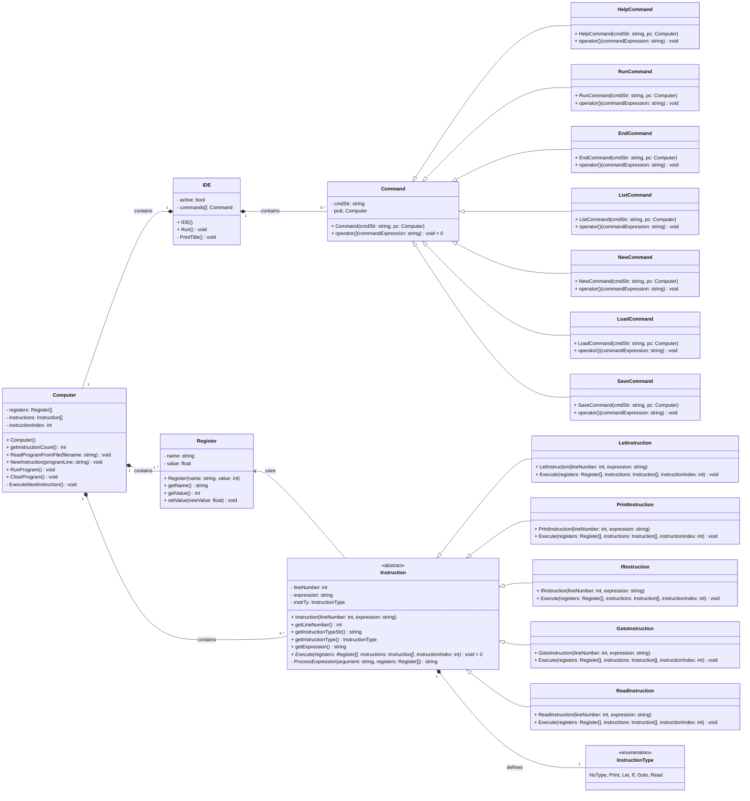
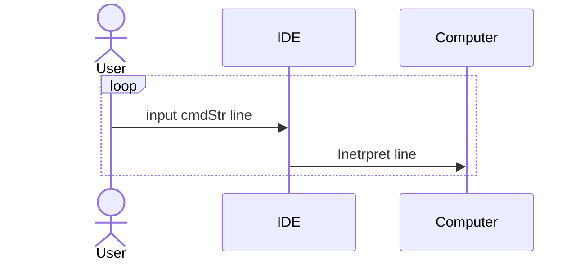

# Prog 2 Nagyházi - BASIC interpeter

> Készítette: Szenes Márton - Spyro

## Programról

A program egy **BASIC**-szerű programozási nyelv butított, egyszerűsített változatát valósítja meg, továbbiakban **BASIC-lite**-nak nevezve. Biztosít a programkód írásához egy interfészt, alap parancsokat a kód szerkesztéséhez, mentéséhez, beolvasásához és futtatásához.

Az értelmező képes regiszterekben számértékeket eltárolni és azokkal műveleteket végezni, feltételes utasításokat végrehajtani, és ugrani a programkódon belül, kiírni a standard kimenetre, és olvasni a standard bementről.

## Program parancsok

- `let <regiszter> = <érték>`: Regiszternek értékadás. Az érték tartalmazhat matematikai alapműveleteket és zárójeleket. (`+`,`-`,`*`,`/`,`%`)
- `print <regiszter>/<string>`: Kiírja a regiszter vagy a kapott idézőjelek közé tett sztring értékét a szabványos kimenetre. A sztring tartalma kizárólag az angol abc nagy- és kisbetűit tartalmazhatja, illetve `\n`(sortörés), `\t`(tab), `\"`(idézőjel) speciális karaktereket.
- `if <feltétel>`: Feltételes elágazás. Ha a feltétel igaz, akkor végrehajtja a következő utasítást a sorban, ellenkező esetben az következő utáni utasításra ugrik a program. A feltétel tartalmazhat számokat, regisztereket, összehasonlító operátorokat, és/vagy/nem logikai kapukat és zárójeleket. (`>`,`>=`,`<`,`<=`,`==`,`!=`,`&&`,`||`,`!`)
- `goto <sorazonosító>`: Ha létezik a sorazonosító, akkor a megjlelölt sorazonosítóhoz ugrik a program. Ha nincs ilyen, akkor hibát dob az értelmező.
- `read <regiszter>`: Beolvas a szabványos bemenetről egy számot és eltárolja az éréket a regiszterben.

## Interfész parancsok

- `HELP`: Kiírja az interfész parancsait, és működésüket
- `RUN`: Futtatja a betöltött programot.
- `END`: Lezárja az aktuális interfészt (kód szerkesztő/alkalmazás).
- `LIST`: Kiírja a betöltött programot sorszám szerint növekvő sorban.
- `NEW`: Új programot hoz létre.
- `LOAD <fájlnév>`: Beolvassa fájlból a programot a kapott fájlnévvel.
- `SAVE <fájlnév>`: Elmenti a betöltött programot a megadott fájlnévvel.

## BASIC-lite interpreter - UML Osztálydiagram

### Hátralévő feladatok
- [ ] Run után két > > -t rak valamiért
- [ ] Run -read-be karaktert írva végtelen >-t ír ki